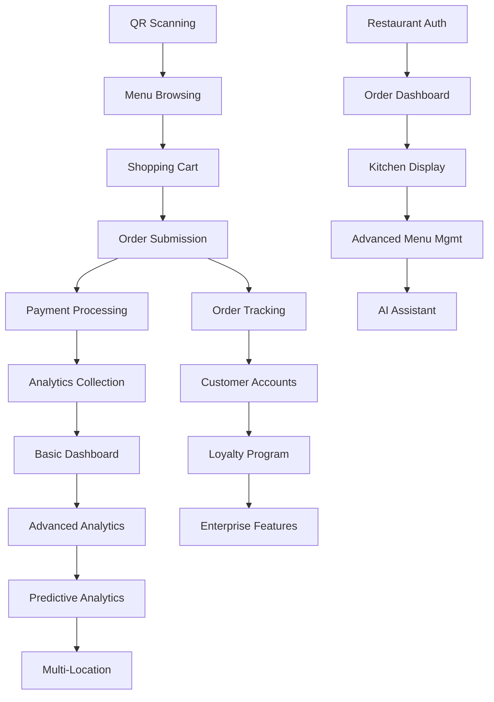

# Urdhëro PRD Task Breakdown - Role-Based Implementation Plan

## Table of Contents
1. [Team Structure and Roles](#team-structure-and-roles)
2. [Phase 1: Foundation Tasks (Months 1-3)](#phase-1-foundation-tasks-months-1-3)
3. [Phase 2: Enhancement Tasks (Months 4-6)](#phase-2-enhancement-tasks-months-4-6)
4. [Phase 3: Advanced Features (Months 7-9)](#phase-3-advanced-features-months-7-9)
5. [Phase 4: Scale and Optimize (Months 10-12)](#phase-4-scale-and-optimize-months-10-12)
6. [Cross-Phase Continuous Tasks](#cross-phase-continuous-tasks)
7. [Task Dependencies Matrix](#task-dependencies-matrix)
8. [Success Metrics and KPIs](#success-metrics-and-kpis)

---

## Team Structure and Roles

### Core Development Team

#### 🎯 **Product Manager (PM)**
**Primary Responsibilities:**
- Feature prioritization and roadmap management
- Stakeholder communication and requirements gathering
- User story definition and acceptance criteria
- Market research and competitive analysis
- Success metrics tracking and reporting

#### 👨‍💻 **Frontend Developer (FE)**
**Primary Responsibilities:**
- React/TypeScript implementation
- UI component development
- PWA implementation
- Performance optimization
- Mobile responsiveness

#### 👩‍💻 **Backend Developer (BE)**
**Primary Responsibilities:**
- Firebase Cloud Functions development
- Database schema design and implementation
- API development and integration
- Security implementation
- Performance optimization

#### 🎨 **UI/UX Designer (UX)**
**Primary Responsibilities:**
- User experience design and research
- Visual design and prototyping
- Design system development
- Usability testing
- Accessibility compliance

#### 🧪 **QA Engineer (QA)**
**Primary Responsibilities:**
- Test strategy and planning
- Automated test development
- Manual testing and validation
- Performance testing
- Security testing

#### ⚙️ **DevOps Engineer (DO)**
**Primary Responsibilities:**
- Infrastructure setup and management
- CI/CD pipeline development
- Monitoring and alerting
- Security and compliance
- Performance monitoring

#### 📊 **Data Analyst (DA)**
**Primary Responsibilities:**
- Analytics implementation
- Business intelligence reporting
- Performance metrics analysis
- User behavior analysis
- A/B testing setup

#### 🔒 **Security Engineer (SE)**
**Primary Responsibilities:**
- Security architecture design
- Vulnerability assessment
- Compliance validation
- Security testing
- Incident response

---

## Phase 1: Foundation Tasks (Months 1-3)

### Epic 1.1: Customer QR Ordering System

#### Task 1.1.1: QR Code Scanning Implementation
**Assigned to:** FE, BE  
**Story Points:** 8  
**Duration:** 2 weeks  

**Frontend Developer Tasks:**
- [ ] **FE-1.1.1a**: Research and select QR code scanning library
  - Evaluate qr-scanner, ZXing, QuaggaJS libraries
  - Test performance across different devices
  - Document browser compatibility matrix
  - **Acceptance Criteria**: Scanner works on iOS Safari, Android Chrome, desktop browsers

- [ ] **FE-1.1.1b**: Implement QR scanner component
  - Create QRScanner React component
  - Implement camera permission handling
  - Add haptic feedback for successful scans
  - **Acceptance Criteria**: Scanner opens in <2s, detects codes in <1s

- [ ] **FE-1.1.1c**: Build QR data parser utility
  - Support URL, JSON, and custom formats
  - Implement validation logic
  - Add error handling for invalid codes
  - **Acceptance Criteria**: Handles all QR formats with clear error messages

**Backend Developer Tasks:**
- [ ] **BE-1.1.1a**: Design QR data structure
  - Define QR code payload format
  - Create validation schemas with Joi
  - Document QR code generation standards
  - **Acceptance Criteria**: Consistent QR format across all tables

**Dependencies:** None  
**Risk:** Medium (camera API compatibility issues)

#### Task 1.1.2: Menu Browsing System
**Assigned to:** FE, BE, UX  
**Story Points:** 13  
**Duration:** 3 weeks  

**UI/UX Designer Tasks:**
- [ ] **UX-1.1.2a**: Design menu browsing wireframes
  - Create mobile-first wireframes
  - Design category navigation system
  - Plan search and filter interactions
  - **Acceptance Criteria**: Wireframes approved by stakeholders

- [ ] **UX-1.1.2b**: Create menu item card designs
  - Design responsive menu item cards
  - Plan image handling and fallbacks
  - Design dietary tag system
  - **Acceptance Criteria**: Designs support all required information

**Frontend Developer Tasks:**
- [ ] **FE-1.1.2a**: Build menu page layout
  - Implement responsive grid system
  - Create category navigation component
  - Add search functionality
  - **Acceptance Criteria**: Menu loads in <1s with smooth navigation

- [ ] **FE-1.1.2b**: Develop MenuItemCard component
  - Build interactive menu item cards
  - Implement add-to-cart functionality
  - Add quantity controls and special instructions
  - **Acceptance Criteria**: Cards support all planned interactions

- [ ] **FE-1.1.2c**: Implement search and filtering
  - Create real-time search functionality
  - Build category and dietary filters
  - Add price range filtering
  - **Acceptance Criteria**: Search results appear in <300ms

**Backend Developer Tasks:**
- [ ] **BE-1.1.2a**: Create menu data structure
  - Design Firestore menu schema
  - Implement security rules
  - Create composite indexes for queries
  - **Acceptance Criteria**: Queries execute in <500ms

- [ ] **BE-1.1.2b**: Build menu API endpoints
  - Create getVenueMenu Cloud Function
  - Implement caching strategy
  - Add error handling and validation
  - **Acceptance Criteria**: API responds in <800ms

**Dependencies:** QR scanning completion  
**Risk:** Low

#### Task 1.1.3: Shopping Cart System
**Assigned to:** FE, PM  
**Story Points:** 8  
**Duration:** 2 weeks  

**Product Manager Tasks:**
- [ ] **PM-1.1.3a**: Define cart behavior requirements
  - Document cart persistence rules
  - Define maximum cart size limits
  - Plan special instructions handling
  - **Acceptance Criteria**: Requirements document approved

**Frontend Developer Tasks:**
- [ ] **FE-1.1.3a**: Build cart context and hooks
  - Create useCart custom hook
  - Implement localStorage persistence
  - Add cart validation logic
  - **Acceptance Criteria**: Cart persists across sessions

- [ ] **FE-1.1.3b**: Develop cart page UI
  - Create cart item list component
  - Build quantity adjustment controls
  - Implement special instructions input
  - **Acceptance Criteria**: All cart operations work smoothly

- [ ] **FE-1.1.3c**: Add cart summary calculations
  - Implement real-time price calculations
  - Add tax and fee calculations
  - Create estimated time calculations
  - **Acceptance Criteria**: Calculations update instantly

**Dependencies:** Menu browsing system  
**Risk:** Low

#### Task 1.1.4: Order Submission and Tracking
**Assigned to:** FE, BE, PM  
**Story Points:** 13  
**Duration:** 3 weeks  

**Product Manager Tasks:**
- [ ] **PM-1.1.4a**: Define order workflow
  - Map complete order lifecycle
  - Define status transition rules
  - Plan error handling scenarios
  - **Acceptance Criteria**: Workflow documented and approved

**Frontend Developer Tasks:**
- [ ] **FE-1.1.4a**: Build checkout process
  - Create checkout form validation
  - Implement payment method selection
  - Add order submission handling
  - **Acceptance Criteria**: Checkout completes in <3s

- [ ] **FE-1.1.4b**: Develop order tracking page
  - Create real-time order status display
  - Build progress visualization
  - Implement order details view
  - **Acceptance Criteria**: Status updates appear in <1s

**Backend Developer Tasks:**
- [ ] **BE-1.1.4a**: Build order management system
  - Create createOrder Cloud Function
  - Implement order number generation
  - Add order validation and processing
  - **Acceptance Criteria**: Orders process successfully with unique numbers

- [ ] **BE-1.1.4b**: Implement real-time updates
  - Set up Firestore listeners
  - Create order status change notifications
  - Implement error handling
  - **Acceptance Criteria**: Real-time updates work reliably

**Dependencies:** Shopping cart system, payment processing  
**Risk:** Medium (real-time complexity)

### Epic 1.2: Restaurant Order Management

#### Task 1.2.1: Restaurant Authentication System
**Assigned to:** BE, SE, PM  
**Story Points:** 13  
**Duration:** 3 weeks  

**Security Engineer Tasks:**
- [ ] **SE-1.2.1a**: Design authentication architecture
  - Define role-based access control
  - Design custom claims structure
  - Plan multi-factor authentication
  - **Acceptance Criteria**: Security architecture approved

**Backend Developer Tasks:**
- [ ] **BE-1.2.1a**: Implement restaurant auth
  - Set up Firebase Auth custom claims
  - Create role-based middleware
  - Implement staff user management
  - **Acceptance Criteria**: Role-based access works correctly

**Product Manager Tasks:**
- [ ] **PM-1.2.1a**: Define user roles and permissions
  - Document admin, manager, staff, kitchen roles
  - Define permission matrix
  - Plan onboarding process
  - **Acceptance Criteria**: Role definitions clear and complete

**Dependencies:** None  
**Risk:** High (security critical)

#### Task 1.2.2: Order Dashboard Development
**Assigned to:** FE, BE, UX  
**Story Points:** 21  
**Duration:** 4 weeks  

**UI/UX Designer Tasks:**
- [ ] **UX-1.2.2a**: Design restaurant dashboard
  - Create dashboard wireframes
  - Design order management interface
  - Plan mobile responsiveness
  - **Acceptance Criteria**: Dashboard design supports all order operations

**Frontend Developer Tasks:**
- [ ] **FE-1.2.2a**: Build order dashboard UI
  - Create order list component
  - Implement filtering and sorting
  - Add real-time order updates
  - **Acceptance Criteria**: Dashboard updates in real-time

- [ ] **FE-1.2.2b**: Implement order actions
  - Build accept/reject order functionality
  - Create status update controls
  - Add order details modal
  - **Acceptance Criteria**: All order actions work with one click

**Backend Developer Tasks:**
- [ ] **BE-1.2.2a**: Create order management APIs
  - Build updateOrderStatus function
  - Implement order filtering queries
  - Add real-time subscriptions
  - **Acceptance Criteria**: Order updates propagate in <1s

**Dependencies:** Restaurant authentication  
**Risk:** Medium (real-time complexity)

#### Task 1.2.3: Basic Menu Management
**Assigned to:** FE, BE, UX  
**Story Points:** 21  
**Duration:** 4 weeks  

**UI/UX Designer Tasks:**
- [ ] **UX-1.2.3a**: Design menu management interface
  - Create menu item CRUD interfaces
  - Design image upload flow
  - Plan category management system
  - **Acceptance Criteria**: Interface supports all menu operations

**Frontend Developer Tasks:**
- [ ] **FE-1.2.3a**: Build menu management pages
  - Create menu item list view
  - Implement add/edit item forms
  - Add image upload functionality
  - **Acceptance Criteria**: Menu operations complete in <30s

**Backend Developer Tasks:**
- [ ] **BE-1.2.3a**: Create menu management APIs
  - Build createMenuItem function
  - Implement updateMenuItem function
  - Add image upload handling
  - **Acceptance Criteria**: Menu changes reflect immediately

**Dependencies:** Restaurant authentication  
**Risk:** Medium (image handling complexity)

### Epic 1.3: Payment Processing Foundation

#### Task 1.3.1: Stripe Integration
**Assigned to:** BE, SE, PM  
**Story Points:** 34  
**Duration:** 5 weeks  

**Product Manager Tasks:**
- [ ] **PM-1.3.1a**: Define payment requirements
  - Research Albanian payment preferences
  - Define supported payment methods
  - Plan currency support (ALL/EUR)
  - **Acceptance Criteria**: Payment requirements documented

**Security Engineer Tasks:**
- [ ] **SE-1.3.1a**: Design payment security
  - Review PCI compliance requirements
  - Design secure payment flow
  - Plan fraud detection integration
  - **Acceptance Criteria**: Payment security architecture approved

**Backend Developer Tasks:**
- [ ] **BE-1.3.1a**: Implement Stripe integration
  - Set up Stripe payment intents
  - Build webhook handling
  - Implement refund processing
  - **Acceptance Criteria**: Payments process in <10s

- [ ] **BE-1.3.1b**: Add payment validation
  - Implement server-side validation
  - Add duplicate payment prevention
  - Create payment audit logging
  - **Acceptance Criteria**: All payments validated and logged

**Dependencies:** Order submission system  
**Risk:** High (financial transactions critical)

---

## Phase 2: Enhancement Tasks (Months 4-6)

### Epic 2.1: Customer Experience Enhancement

#### Task 2.1.1: Multi-Language Support Implementation
**Assigned to:** FE, UX, PM  
**Story Points:** 21  
**Duration:** 4 weeks  

**Product Manager Tasks:**
- [ ] **PM-2.1.1a**: Define localization strategy
  - Research target languages and markets
  - Define translation workflow
  - Plan content management for translations
  - **Acceptance Criteria**: Localization strategy approved

**UI/UX Designer Tasks:**
- [ ] **UX-2.1.1a**: Design language switching UX
  - Create language selector component
  - Plan text expansion handling
  - Design RTL layout preparation
  - **Acceptance Criteria**: Language switching is intuitive

**Frontend Developer Tasks:**
- [ ] **FE-2.1.1a**: Implement i18n framework
  - Set up translation system
  - Create translation hooks
  - Implement dynamic language switching
  - **Acceptance Criteria**: Language changes in <500ms

- [ ] **FE-2.1.1b**: Create translation management
  - Build translation key extraction
  - Implement fallback handling
  - Add missing translation detection
  - **Acceptance Criteria**: All text elements properly translated

**Dependencies:** Core customer features complete  
**Risk:** Medium (translation complexity)

#### Task 2.1.2: Customer Account System
**Assigned to:** FE, BE, SE  
**Story Points:** 21  
**Duration:** 4 weeks  

**Security Engineer Tasks:**
- [ ] **SE-2.1.2a**: Design customer data protection
  - Plan GDPR compliance implementation
  - Design data retention policies
  - Create privacy controls
  - **Acceptance Criteria**: Customer data protection compliant

**Backend Developer Tasks:**
- [ ] **BE-2.1.2a**: Implement customer profiles
  - Create customer data schema
  - Build profile management APIs
  - Implement preference storage
  - **Acceptance Criteria**: Customer profiles fully functional

**Frontend Developer Tasks:**
- [ ] **FE-2.1.2a**: Build account management UI
  - Create registration/login flows
  - Build profile management pages
  - Implement preference settings
  - **Acceptance Criteria**: Account creation in <60s

**Dependencies:** Authentication foundation  
**Risk:** Medium (privacy compliance)

#### Task 2.1.3: Push Notifications System
**Assigned to:** FE, BE, DO  
**Story Points:** 13  
**Duration:** 3 weeks  

**DevOps Engineer Tasks:**
- [ ] **DO-2.1.3a**: Set up notification infrastructure
  - Configure Firebase Cloud Messaging
  - Set up notification templates
  - Plan delivery tracking
  - **Acceptance Criteria**: Notification infrastructure ready

**Backend Developer Tasks:**
- [ ] **BE-2.1.3a**: Implement notification triggers
  - Create order status notifications
  - Build promotional message system
  - Add notification preferences
  - **Acceptance Criteria**: Notifications sent reliably

**Frontend Developer Tasks:**
- [ ] **FE-2.1.3a**: Add notification handling
  - Implement FCM client integration
  - Create notification permission requests
  - Build notification display system
  - **Acceptance Criteria**: Notifications work across all browsers

**Dependencies:** Customer accounts, order tracking  
**Risk:** Medium (browser compatibility)

### Epic 2.2: Restaurant Operations Enhancement

#### Task 2.2.1: Kitchen Display System
**Assigned to:** FE, UX, BE  
**Story Points:** 21  
**Duration:** 4 weeks  

**UI/UX Designer Tasks:**
- [ ] **UX-2.2.1a**: Design kitchen interface
  - Create large display optimized layouts
  - Design color-coding system for priorities
  - Plan touch interface for kitchen use
  - **Acceptance Criteria**: Design optimized for kitchen environment

**Frontend Developer Tasks:**
- [ ] **FE-2.2.1a**: Build kitchen display app
  - Create large-screen optimized components
  - Implement auto-refresh functionality
  - Add color-coded priority system
  - **Acceptance Criteria**: Display works on 24"+ monitors

- [ ] **FE-2.2.1b**: Add kitchen-specific features
  - Implement touch controls for kitchen gloves
  - Add sound alerts for urgent orders
  - Create print integration
  - **Acceptance Criteria**: Kitchen staff can operate without mouse/keyboard

**Backend Developer Tasks:**
- [ ] **BE-2.2.1a**: Optimize kitchen data delivery
  - Create kitchen-specific data queries
  - Implement real-time order streaming
  - Add performance optimizations
  - **Acceptance Criteria**: Kitchen display updates every 10s

**Dependencies:** Order management system  
**Risk:** Medium (hardware compatibility)

#### Task 2.2.2: Advanced Menu Management
**Assigned to:** FE, BE, UX  
**Story Points:** 34  
**Duration:** 6 weeks  

**UI/UX Designer Tasks:**
- [ ] **UX-2.2.2a**: Design advanced menu editor
  - Create WYSIWYG editor interface
  - Design bulk operations interface
  - Plan image management system
  - **Acceptance Criteria**: Editor supports all menu operations

**Frontend Developer Tasks:**
- [ ] **FE-2.2.2a**: Build rich menu editor
  - Implement rich text editing
  - Create image upload and cropping
  - Build category management
  - **Acceptance Criteria**: Menu editing is intuitive and fast

- [ ] **FE-2.2.2b**: Add bulk operations
  - Implement bulk availability updates
  - Create menu import/export
  - Add duplicate item functionality
  - **Acceptance Criteria**: Bulk operations save significant time

**Backend Developer Tasks:**
- [ ] **BE-2.2.2a**: Enhance menu APIs
  - Add batch update operations
  - Implement image optimization
  - Create menu versioning system
  - **Acceptance Criteria**: Menu operations are atomic and reliable

**Dependencies:** Basic menu management  
**Risk:** Medium (editor complexity)

#### Task 2.2.3: QR Code Management System
**Assigned to:** FE, BE, UX  
**Story Points:** 13  
**Duration:** 3 weeks  

**UI/UX Designer Tasks:**
- [ ] **UX-2.2.3a**: Design QR management interface
  - Create table management interface
  - Design QR code customization options
  - Plan bulk export functionality
  - **Acceptance Criteria**: Interface supports all QR operations

**Frontend Developer Tasks:**
- [ ] **FE-2.2.3a**: Build QR management pages
  - Create table CRUD interface
  - Implement QR code preview
  - Add bulk download functionality
  - **Acceptance Criteria**: QR codes generate in <3s

**Backend Developer Tasks:**
- [ ] **BE-2.2.3a**: Implement QR generation
  - Create generateTableQR function
  - Add QR code customization
  - Implement scan analytics tracking
  - **Acceptance Criteria**: QR codes work reliably across devices

**Dependencies:** Restaurant authentication  
**Risk:** Low

### Epic 2.3: Basic Analytics Implementation

#### Task 2.3.1: Analytics Data Collection
**Assigned to:** BE, DA, DO  
**Story Points:** 21  
**Duration:** 4 weeks  

**Data Analyst Tasks:**
- [ ] **DA-2.3.1a**: Define analytics requirements
  - Identify key business metrics
  - Design data collection strategy
  - Plan reporting requirements
  - **Acceptance Criteria**: Analytics requirements documented

**DevOps Engineer Tasks:**
- [ ] **DO-2.3.1a**: Set up analytics infrastructure
  - Configure Google Analytics 4
  - Set up custom event tracking
  - Plan data pipeline architecture
  - **Acceptance Criteria**: Analytics infrastructure operational

**Backend Developer Tasks:**
- [ ] **BE-2.3.1a**: Implement data collection
  - Create analytics event functions
  - Build data aggregation queries
  - Implement real-time metrics
  - **Acceptance Criteria**: All events tracked accurately

**Dependencies:** Order management system  
**Risk:** Medium (data privacy compliance)

#### Task 2.3.2: Basic Dashboard Development
**Assigned to:** FE, UX, DA  
**Story Points:** 21  
**Duration:** 4 weeks  

**UI/UX Designer Tasks:**
- [ ] **UX-2.3.2a**: Design analytics dashboard
  - Create dashboard wireframes
  - Design chart and visualization system
  - Plan mobile dashboard layout
  - **Acceptance Criteria**: Dashboard design supports key metrics

**Data Analyst Tasks:**
- [ ] **DA-2.3.2a**: Define dashboard metrics
  - Identify key performance indicators
  - Design metric calculation methods
  - Plan data visualization requirements
  - **Acceptance Criteria**: Metrics provide actionable insights

**Frontend Developer Tasks:**
- [ ] **FE-2.3.2a**: Build analytics dashboard
  - Create chart components
  - Implement metric displays
  - Add date range selection
  - **Acceptance Criteria**: Dashboard loads in <5s

**Dependencies:** Analytics data collection  
**Risk:** Low

---

## Phase 3: Advanced Features (Months 7-9)

### Epic 3.1: Loyalty Program Implementation

#### Task 3.1.1: Loyalty System Architecture
**Assigned to:** BE, PM, DA  
**Story Points:** 21  
**Duration:** 4 weeks  

**Product Manager Tasks:**
- [ ] **PM-3.1.1a**: Design loyalty program structure
  - Define tier system and benefits
  - Plan points earning and redemption rules
  - Design referral program mechanics
  - **Acceptance Criteria**: Loyalty program rules documented

**Data Analyst Tasks:**
- [ ] **DA-3.1.1a**: Model loyalty economics
  - Calculate tier thresholds and benefits
  - Model customer lifetime value impact
  - Plan loyalty analytics tracking
  - **Acceptance Criteria**: Loyalty economics validated

**Backend Developer Tasks:**
- [ ] **BE-3.1.1a**: Build loyalty data model
  - Create loyalty user schema
  - Implement points calculation system
  - Build tier progression logic
  - **Acceptance Criteria**: Loyalty system handles points accurately

**Dependencies:** Customer account system  
**Risk:** Medium (complex business logic)

#### Task 3.1.2: Loyalty UI Development
**Assigned to:** FE, UX  
**Story Points:** 13  
**Duration:** 3 weeks  

**UI/UX Designer Tasks:**
- [ ] **UX-3.1.2a**: Design loyalty interface
  - Create loyalty dashboard mockups
  - Design tier progression visualization
  - Plan rewards catalog interface
  - **Acceptance Criteria**: Loyalty UI motivates engagement

**Frontend Developer Tasks:**
- [ ] **FE-3.1.2a**: Build loyalty components
  - Create loyalty dashboard
  - Implement tier progress visualization
  - Build rewards redemption interface
  - **Acceptance Criteria**: Loyalty features are engaging and clear

**Dependencies:** Loyalty system architecture  
**Risk:** Low

### Epic 3.2: AI Menu Assistant

#### Task 3.2.1: AI Service Integration
**Assigned to:** BE, PM  
**Story Points:** 34  
**Duration:** 6 weeks  

**Product Manager Tasks:**
- [ ] **PM-3.2.1a**: Define AI feature requirements
  - Research AI service providers
  - Define content generation requirements
  - Plan pricing analysis features
  - **Acceptance Criteria**: AI requirements clearly defined

**Backend Developer Tasks:**
- [ ] **BE-3.2.1a**: Integrate AI services
  - Set up OpenAI API integration
  - Build content generation functions
  - Implement price analysis system
  - **Acceptance Criteria**: AI responses in <10s

- [ ] **BE-3.2.1b**: Add AI content validation
  - Implement content quality filters
  - Add inappropriate content detection
  - Create manual review workflow
  - **Acceptance Criteria**: AI content meets quality standards

**Dependencies:** Menu management system  
**Risk:** High (AI service dependency)

#### Task 3.2.2: AI Assistant UI
**Assigned to:** FE, UX  
**Story Points:** 21  
**Duration:** 4 weeks  

**UI/UX Designer Tasks:**
- [ ] **UX-3.2.2a**: Design AI assistant interface
  - Create AI interaction patterns
  - Design suggestion display system
  - Plan loading and feedback states
  - **Acceptance Criteria**: AI interface is intuitive and helpful

**Frontend Developer Tasks:**
- [ ] **FE-3.2.2a**: Build AI assistant components
  - Create AI suggestion interface
  - Implement real-time content generation
  - Add loading states and error handling
  - **Acceptance Criteria**: AI assistant enhances menu creation

**Dependencies:** AI service integration  
**Risk:** Medium (complex interactions)

### Epic 3.3: Advanced Analytics

#### Task 3.3.1: Customer Segmentation
**Assigned to:** DA, BE  
**Story Points:** 21  
**Duration:** 4 weeks  

**Data Analyst Tasks:**
- [ ] **DA-3.3.1a**: Design segmentation model
  - Define customer segments
  - Create segmentation algorithms
  - Plan behavioral analysis
  - **Acceptance Criteria**: Segmentation provides actionable insights

**Backend Developer Tasks:**
- [ ] **BE-3.3.1a**: Implement segmentation engine
  - Build customer scoring system
  - Create segment assignment logic
  - Implement segment analytics
  - **Acceptance Criteria**: Segmentation updates automatically

**Dependencies:** Customer data collection  
**Risk:** Medium (algorithm complexity)

#### Task 3.3.2: Predictive Analytics
**Assigned to:** DA, BE  
**Story Points:** 34  
**Duration:** 6 weeks  

**Data Analyst Tasks:**
- [ ] **DA-3.3.2a**: Build prediction models
  - Create demand forecasting models
  - Build customer churn prediction
  - Implement recommendation engine
  - **Acceptance Criteria**: Models achieve >80% accuracy

**Backend Developer Tasks:**
- [ ] **BE-3.3.2a**: Implement prediction pipeline
  - Build model serving infrastructure
  - Create batch prediction jobs
  - Add real-time inference
  - **Acceptance Criteria**: Predictions available in real-time

**Dependencies:** Advanced analytics data  
**Risk:** High (ML model complexity)

---

## Phase 4: Scale and Optimize (Months 10-12)

### Epic 4.1: Performance Optimization

#### Task 4.1.1: Frontend Performance
**Assigned to:** FE, DO  
**Story Points:** 21  
**Duration:** 4 weeks  

**Frontend Developer Tasks:**
- [ ] **FE-4.1.1a**: Implement advanced caching
  - Add service worker caching strategies
  - Implement code splitting optimization
  - Create lazy loading improvements
  - **Acceptance Criteria**: Page load time <2s on 3G

- [ ] **FE-4.1.1b**: Optimize bundle size
  - Analyze and reduce bundle size
  - Implement tree shaking
  - Add dynamic imports
  - **Acceptance Criteria**: Initial bundle <1MB

**DevOps Engineer Tasks:**
- [ ] **DO-4.1.1a**: Set up CDN optimization
  - Configure global CDN
  - Implement image optimization
  - Add asset compression
  - **Acceptance Criteria**: Global load times improved

**Dependencies:** Core features complete  
**Risk:** Low

#### Task 4.1.2: Backend Optimization
**Assigned to:** BE, DO  
**Story Points:** 21  
**Duration:** 4 weeks  

**Backend Developer Tasks:**
- [ ] **BE-4.1.2a**: Optimize database queries
  - Analyze slow queries
  - Add database indexes
  - Implement query caching
  - **Acceptance Criteria**: Query times <500ms

**DevOps Engineer Tasks:**
- [ ] **DO-4.1.2a**: Implement advanced monitoring
  - Add APM tools
  - Create performance dashboards
  - Set up alerting systems
  - **Acceptance Criteria**: Performance issues detected automatically

**Dependencies:** Core backend complete  
**Risk:** Low

### Epic 4.2: Enterprise Features

#### Task 4.2.1: Multi-Location Management
**Assigned to:** FE, BE, PM  
**Story Points:** 34  
**Duration:** 6 weeks  

**Product Manager Tasks:**
- [ ] **PM-4.2.1a**: Define multi-location requirements
  - Research enterprise customer needs
  - Define location hierarchy system
  - Plan centralized management features
  - **Acceptance Criteria**: Enterprise requirements documented

**Backend Developer Tasks:**
- [ ] **BE-4.2.1a**: Build multi-location architecture
  - Create location hierarchy data model
  - Implement centralized user management
  - Add cross-location analytics
  - **Acceptance Criteria**: Multi-location system scalable

**Frontend Developer Tasks:**
- [ ] **FE-4.2.1a**: Build enterprise interface
  - Create location switching interface
  - Build centralized dashboard
  - Add role management across locations
  - **Acceptance Criteria**: Enterprise interface intuitive

**Dependencies:** Core platform features  
**Risk:** High (architectural complexity)

#### Task 4.2.2: Advanced Reporting
**Assigned to:** DA, FE, BE  
**Story Points:** 21  
**Duration:** 4 weeks  

**Data Analyst Tasks:**
- [ ] **DA-4.2.2a**: Design advanced reports
  - Create executive dashboard requirements
  - Design custom report builder
  - Plan automated report generation
  - **Acceptance Criteria**: Reports provide strategic insights

**Frontend Developer Tasks:**
- [ ] **FE-4.2.2a**: Build reporting interface
  - Create custom report builder
  - Implement data visualization
  - Add report scheduling
  - **Acceptance Criteria**: Reports generated easily

**Backend Developer Tasks:**
- [ ] **BE-4.2.2a**: Implement report generation
  - Build report generation engine
  - Add data export functionality
  - Implement scheduled reports
  - **Acceptance Criteria**: Reports generate automatically

**Dependencies:** Advanced analytics  
**Risk:** Medium (reporting complexity)

### Epic 4.3: Market Expansion Preparation

#### Task 4.3.1: Regulatory Compliance
**Assigned to:** SE, PM, QA  
**Story Points:** 21  
**Duration:** 4 weeks  

**Security Engineer Tasks:**
- [ ] **SE-4.3.1a**: Implement EU compliance
  - Add GDPR compliance features
  - Implement data portability
  - Create consent management
  - **Acceptance Criteria**: EU compliance validated

**Product Manager Tasks:**
- [ ] **PM-4.3.1a**: Research market requirements
  - Analyze regulatory requirements
  - Plan localization needs
  - Define market entry strategy
  - **Acceptance Criteria**: Market entry plan approved

**QA Engineer Tasks:**
- [ ] **QA-4.3.1a**: Validate compliance
  - Test GDPR compliance features
  - Validate data handling procedures
  - Create compliance test suite
  - **Acceptance Criteria**: Compliance verified through testing

**Dependencies:** Core platform features  
**Risk:** High (regulatory complexity)

#### Task 4.3.2: API Platform Development
**Assigned to:** BE, PM  
**Story Points:** 34  
**Duration:** 6 weeks  

**Product Manager Tasks:**
- [ ] **PM-4.3.2a**: Define API platform requirements
  - Research partner integration needs
  - Define API versioning strategy
  - Plan developer onboarding
  - **Acceptance Criteria**: API platform requirements documented

**Backend Developer Tasks:**
- [ ] **BE-4.3.2a**: Build public API
  - Create REST API endpoints
  - Implement API authentication
  - Add rate limiting and monitoring
  - **Acceptance Criteria**: API ready for partner integration

- [ ] **BE-4.3.2b**: Create API documentation
  - Build interactive API docs
  - Create SDK samples
  - Add integration tutorials
  - **Acceptance Criteria**: Developers can integrate in <1 day

**Dependencies:** Core platform stable  
**Risk:** Medium (API design complexity)

---

## Cross-Phase Continuous Tasks

### Quality Assurance (Ongoing)

#### QA Engineer Continuous Tasks:
- [ ] **QA-CONT-1**: Automated Testing Maintenance
  - Update test suites for new features
  - Maintain test data and fixtures
  - Monitor test coverage metrics
  - **Schedule**: Weekly reviews

- [ ] **QA-CONT-2**: Manual Testing Execution
  - Execute manual test cases
  - Perform exploratory testing
  - Validate bug fixes
  - **Schedule**: Daily during active development

- [ ] **QA-CONT-3**: Performance Testing
  - Execute load testing scenarios
  - Monitor performance regressions
  - Validate scalability improvements
  - **Schedule**: Bi-weekly during development

### DevOps and Infrastructure (Ongoing)

#### DevOps Engineer Continuous Tasks:
- [ ] **DO-CONT-1**: Infrastructure Monitoring
  - Monitor system health and performance
  - Respond to alerts and incidents
  - Optimize resource utilization
  - **Schedule**: 24/7 monitoring with on-call rotation

- [ ] **DO-CONT-2**: Security Updates
  - Apply security patches
  - Update dependencies
  - Monitor security vulnerabilities
  - **Schedule**: Weekly security updates

- [ ] **DO-CONT-3**: Backup and Recovery
  - Verify backup integrity
  - Test disaster recovery procedures
  - Update recovery documentation
  - **Schedule**: Daily backup verification, monthly DR tests

### Security (Ongoing)

#### Security Engineer Continuous Tasks:
- [ ] **SE-CONT-1**: Security Monitoring
  - Monitor security logs and alerts
  - Investigate security incidents
  - Update security policies
  - **Schedule**: Daily monitoring

- [ ] **SE-CONT-2**: Vulnerability Management
  - Conduct security assessments
  - Perform penetration testing
  - Update threat models
  - **Schedule**: Monthly assessments

- [ ] **SE-CONT-3**: Compliance Auditing
  - Audit compliance requirements
  - Update privacy policies
  - Train team on security practices
  - **Schedule**: Quarterly audits

---

## Task Dependencies Matrix

### Critical Path Dependencies



### Phase Dependencies
- **Phase 2** cannot start until Phase 1 core features are 80% complete
- **Phase 3** requires Phase 2 customer and restaurant features complete
- **Phase 4** requires stable Phase 3 features with user feedback incorporated

### Inter-Team Dependencies
- **Frontend** depends on Backend API completion
- **QA** depends on feature implementation completion
- **Analytics** depends on data collection infrastructure
- **Security** reviews required before each phase deployment

---

## Success Metrics and KPIs

### Development Velocity Metrics

#### Sprint Metrics (2-week sprints)
```typescript
interface SprintMetrics {
  storyPointsCompleted: {
    target: 40;
    measurement: 'per-sprint';
  };
  bugEscapeRate: {
    target: 5; // percentage
    measurement: 'bugs-found-in-production';
  };
  codeReviewCycle: {
    target: 24; // hours
    measurement: 'average-review-time';
  };
}
```

#### Quality Metrics
```typescript
interface QualityMetrics {
  testCoverage: {
    unit: { target: 80 }; // percentage
    integration: { target: 70 }; // percentage
    e2e: { target: 60 }; // percentage
  };
  defectDensity: {
    target: 5; // defects per 100 story points
    measurement: 'post-release-defects';
  };
  technicalDebt: {
    target: 20; // percentage of velocity
    measurement: 'time-spent-on-debt';
  };
}
```

### Business Success Metrics

#### Customer Adoption
- **User Registration Rate**: >15% of QR scans convert to accounts
- **Order Completion Rate**: >95% of started orders complete
- **Customer Retention**: >60% monthly active user retention
- **Net Promoter Score**: >70 customer satisfaction

#### Restaurant Success
- **Restaurant Onboarding**: 150+ restaurants in first year
- **Feature Adoption**: >80% of restaurants use menu management
- **Support Ticket Volume**: <5% of users require support
- **Revenue Per Restaurant**: >€200/month average

### Technical Performance Metrics

#### Application Performance
- **Page Load Time**: <2s on 3G connection (95th percentile)
- **API Response Time**: <500ms average
- **Uptime**: 99.9% availability
- **Error Rate**: <0.1% of requests

#### Development Performance
- **Deployment Frequency**: Daily deployments to staging
- **Lead Time**: <5 days from feature start to production
- **Mean Time to Recovery**: <2 hours for critical issues
- **Change Failure Rate**: <5% of deployments cause issues

---

## Risk Mitigation Strategies

### Technical Risk Mitigation

#### High-Risk Areas
1. **Firebase Vendor Lock-in**
   - **Mitigation**: Create abstraction layers for all Firebase services
   - **Owner**: BE team
   - **Timeline**: Ongoing

2. **Real-time Performance**
   - **Mitigation**: Implement fallback polling mechanisms
   - **Owner**: BE, FE teams
   - **Timeline**: Phase 1

3. **AI Service Reliability**
   - **Mitigation**: Create fallback content and caching
   - **Owner**: BE team
   - **Timeline**: Phase 3

#### Medium-Risk Areas
1. **Mobile Browser Compatibility**
   - **Mitigation**: Comprehensive device testing matrix
   - **Owner**: QA team
   - **Timeline**: Ongoing

2. **Payment Processing Complexity**
   - **Mitigation**: Extensive testing and monitoring
   - **Owner**: BE, SE teams
   - **Timeline**: Phase 1

### Business Risk Mitigation

#### Market Risks
1. **Competition from Established Players**
   - **Mitigation**: Focus on unique Albanian market needs
   - **Owner**: PM team
   - **Timeline**: Ongoing

2. **Restaurant Adoption Challenges**
   - **Mitigation**: Pilot program with key restaurants
   - **Owner**: PM, Sales teams
   - **Timeline**: Phase 1

#### Operational Risks
1. **Team Scaling Challenges**
   - **Mitigation**: Comprehensive documentation and training
   - **Owner**: All teams
   - **Timeline**: Ongoing

2. **Customer Support Scaling**
   - **Mitigation**: Self-service features and automation
   - **Owner**: PM, Support teams
   - **Timeline**: Phase 2

---

## Communication and Coordination

### Daily Operations

#### Daily Standups (15 minutes)
- **Time**: 9:00 AM CET
- **Participants**: All development team members
- **Format**: Yesterday, today, blockers
- **Tool**: Slack/Microsoft Teams

#### Weekly Planning

#### Sprint Planning (2 hours every 2 weeks)
- **Participants**: PM, Development teams
- **Agenda**: Backlog refinement, sprint goal setting, task assignment
- **Output**: Sprint backlog with clear assignments

#### Sprint Review (1 hour every 2 weeks)
- **Participants**: All teams + stakeholders
- **Agenda**: Demo completed features, gather feedback
- **Output**: Feature acceptance and feedback for backlog

#### Monthly Reviews

#### Cross-Team Sync (1 hour monthly)
- **Participants**: Team leads from all roles
- **Agenda**: Dependency coordination, risk review, roadmap updates
- **Output**: Updated project timeline and risk register

#### Stakeholder Review (2 hours monthly)
- **Participants**: PM, team leads, business stakeholders
- **Agenda**: Progress review, metric analysis, strategic decisions
- **Output**: Approved changes to roadmap and priorities

### Communication Tools

#### Project Management
- **Tool**: Jira or Linear
- **Usage**: Task tracking, sprint management, reporting
- **Access**: All team members

#### Documentation
- **Tool**: Notion or Confluence
- **Usage**: Requirements, technical docs, meeting notes
- **Access**: All team members + stakeholders

#### Communication
- **Tool**: Slack
- **Channels**: #general, #development, #design, #qa, #devops
- **Usage**: Daily communication, quick decisions, alerts

---

## Quality Gates and Checkpoints

### Definition of Ready (DoR)
Before a task can be started:
- [ ] Requirements clearly documented
- [ ] Acceptance criteria defined
- [ ] Dependencies identified and resolved
- [ ] Design assets available (if needed)
- [ ] Technical approach approved
- [ ] Testing strategy defined

### Definition of Done (DoD)
Before a task can be considered complete:
- [ ] Functionality implemented per requirements
- [ ] Unit tests written and passing (>80% coverage)
- [ ] Integration tests passing
- [ ] Code reviewed and approved
- [ ] Documentation updated
- [ ] Accessibility validated
- [ ] Performance requirements met
- [ ] Security review completed (if applicable)
- [ ] Deployed to staging environment
- [ ] QA testing completed and approved
- [ ] Product Owner acceptance

### Phase Gates
Before moving to the next phase:
- [ ] All P0 (Critical) features completed and tested
- [ ] Performance benchmarks met
- [ ] Security requirements validated
- [ ] User acceptance testing completed
- [ ] Business metrics targets achieved
- [ ] Technical debt below threshold (20%)
- [ ] Production deployment successful
- [ ] Post-launch monitoring confirms stability

---

## Resource Allocation

### Team Capacity Planning

#### Phase 1 (Months 1-3)
- **Frontend Developer**: 100% allocation
- **Backend Developer**: 100% allocation
- **UI/UX Designer**: 80% allocation
- **QA Engineer**: 60% allocation
- **DevOps Engineer**: 40% allocation
- **Product Manager**: 100% allocation

#### Phase 2 (Months 4-6)
- **Frontend Developer**: 100% allocation
- **Backend Developer**: 100% allocation
- **UI/UX Designer**: 60% allocation
- **QA Engineer**: 80% allocation
- **DevOps Engineer**: 60% allocation
- **Data Analyst**: 40% allocation (new role)

#### Phase 3 (Months 7-9)
- **Frontend Developer**: 100% allocation
- **Backend Developer**: 100% allocation
- **UI/UX Designer**: 40% allocation
- **QA Engineer**: 80% allocation
- **DevOps Engineer**: 60% allocation
- **Data Analyst**: 80% allocation
- **Security Engineer**: 40% allocation (new role)

#### Phase 4 (Months 10-12)
- **All roles**: Scale based on Phase 3 learnings
- **Additional roles**: Consider scaling team based on success metrics

### Budget Allocation

#### Development Costs (Monthly)
- **Personnel**: 85% of budget
- **Infrastructure**: 10% of budget (Firebase, Stripe, monitoring)
- **External Services**: 3% of budget (AI services, SMS, email)
- **Tools and Licenses**: 2% of budget

#### Infrastructure Scaling
- **Months 1-3**: Development/staging environments
- **Months 4-6**: Production environment + basic monitoring
- **Months 7-9**: Enhanced monitoring + analytics infrastructure
- **Months 10-12**: Global CDN + enterprise features

---

## Conclusion

This task breakdown provides a comprehensive implementation plan for the Urdhëro PRD with:

- **Clear role assignments** for all team members
- **Detailed task breakdown** with acceptance criteria
- **Realistic timelines** based on complexity estimates
- **Risk mitigation strategies** for all identified risks
- **Quality gates** to ensure high standards
- **Communication plans** for effective coordination
- **Success metrics** to measure progress

The plan is designed to deliver a production-ready, scalable restaurant ordering platform that meets all customer requirements while maintaining high quality and performance standards.

Regular review and adjustment of this plan will ensure successful delivery within the 12-month timeline while adapting to market feedback and technical discoveries.

---

**Document Owner**: Project Manager  
**Last Updated**: January 2025  
**Review Schedule**: Bi-weekly during active development  
**Approval Required**: Development Team Leads, Product Manager, CTO